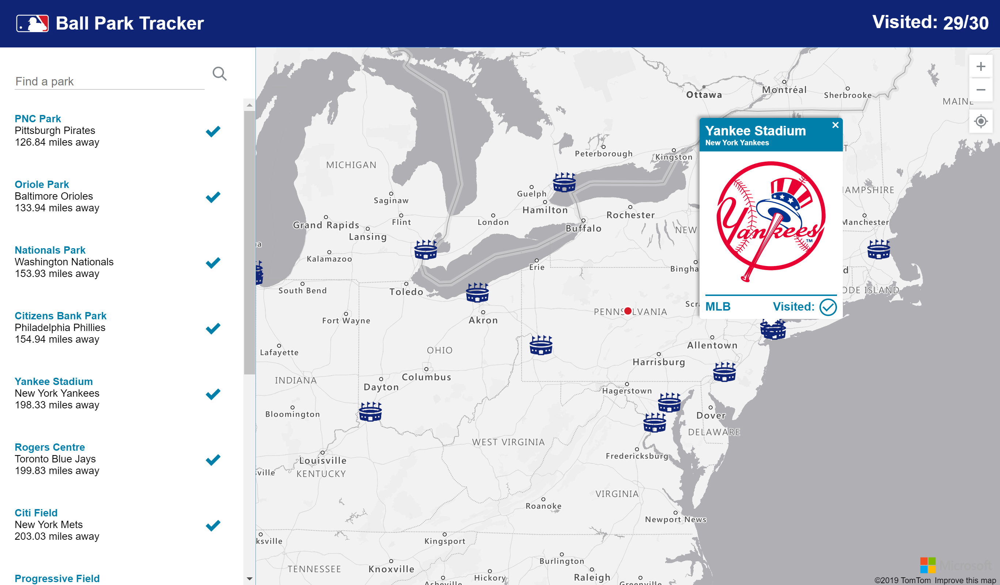

# ⚾ Ballpark Tracker

A simple application used for tracking which MLB and AAA stadiums a [Ballpark Chaser](https://www.ballparkchasers.com/) has been to.



## Contributing

> NOTE: This project requires [Node.js](https://nodejs.org/) and [MongoDB](https://www.mongodb.com/). Only pull requests that statisfy the [ESLint rules](https://github.com/nikmd23/ballpark-tracker/blob/master/.eslintrc.json) will be accepted. 

Contributions to this repository have been made easy! Simply click the "**VS Online - Create**" button above to have a complete development environment, including all dependencies, spun up on your behalf. Learn more at [online.visualstudio.com](http://online.visualstudio.com).

Additionally, this app requires an API key for Azure Maps to be configured as an environment variable:

```
export AZURE_MAPS_KEY=<YOUR_KEY_GOES_HERE>
```

### Links

- [Sports Venue Datasource](https://hifld-geoplatform.opendata.arcgis.com/datasets/major-sport-venues/data)
- [Sports Venue Usage Datasource](https://hifld-geoplatform.opendata.arcgis.com/datasets/major-sport-venues-usage/data)
- [Sports Logo Compilation](http://www.sportslogos.net/)
- [Base App](https://docs.microsoft.com/en-us/azure/azure-maps/tutorial-create-store-locator)
